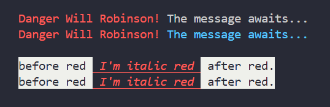
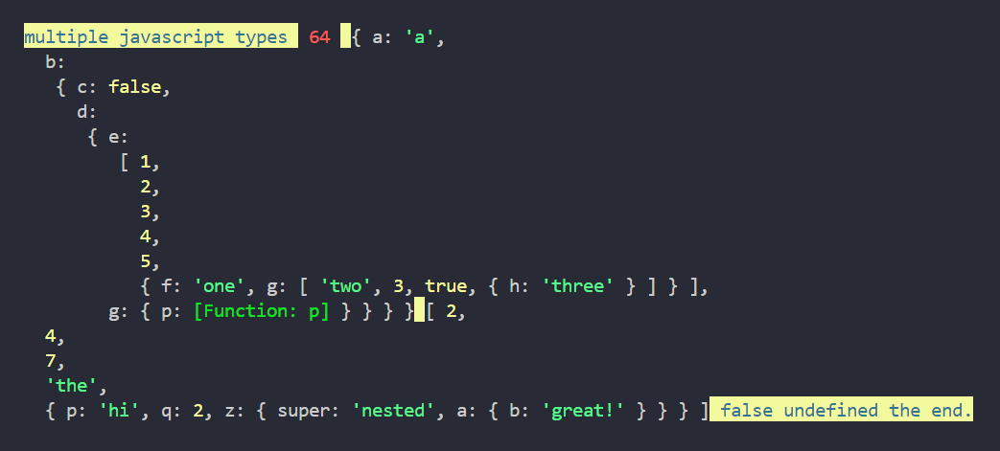

# chog

## Simplified Chalk and Console.log with Web Friendly util.inspect for Arrays and Objects

- **This library modifies the String.prototype** for the current shell session.
- Combines advanced color techniques to simplify console.log messages.
- [NPM chog](https://www.npmjs.com/package/chog)

```ts
// download
nmp i chog

// commonjs
const chog = require('chog');
// esm
import chog from 'chog';

// chog will console.log for you.                    any order 👇
chog.black.whiteBg('before red', " I'm italic red ".red.italic.underline.blackBg, 'after red.');
```

## Colors

```ts
// Colors
const colors = ['black', 'red', 'green', 'yellow', 'blue', 'magenta', 'cyan', 'white', 'gray', 'grey'];
const backgroundColors = [
  'blackBg',
  'redBg',
  'greenBg',
  'yellowBg',
  'blueBg',
  'magentaBg',
  'cyanBg',
  'whiteBg',
  'grayBg',
  'greyBg',
];
const styles = ['bolder', 'dim', 'italic', 'underline', 'reset'];
```

## Simple Example

- (https://github.com/webmastersmith/chog/blob/9c2de53eb6dfb551c1ba1f269b951d5e5b7c7776/images/red.png)

```ts
// see image 👆
chog.black.whiteBg('before red', " I'm italic red ".red.italic.underline.blackBg, 'after red.');
// same as                                           reset must come last 👇
chog.black.whiteBg('before red', " I'm italic red ".red.italic.underline.reset, 'after red.');
```

## Advanced Example

- 

```ts
// Automatic web friendly object destructuring 👆.
// Object and Array colors are fixed and cannot be altered.
const obj = {
  a: 'a',
  b: {
    c: false,
    d: {
      e: [1, 2, 3, 4, 5, { f: 'one', g: ['two', 3, true, { h: 'three' }] }],
      g: {
        p: (v: string) => {
          return '?';
        },
      },
    },
  },
};
const arr = [
  2,
  4,
  7,
  'the',
  {
    p: 'hi',
    q: 2,
    z: {
      super: 'nested',
      a: {
        b: 'great!',
      },
    },
  },
];

chog.blue.yellowBg('multiple javascript types', ' 64 '.red.reset, obj, arr, false, undefined, 'the end.');
```
